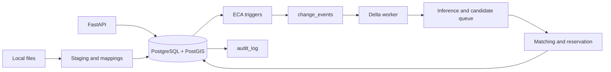
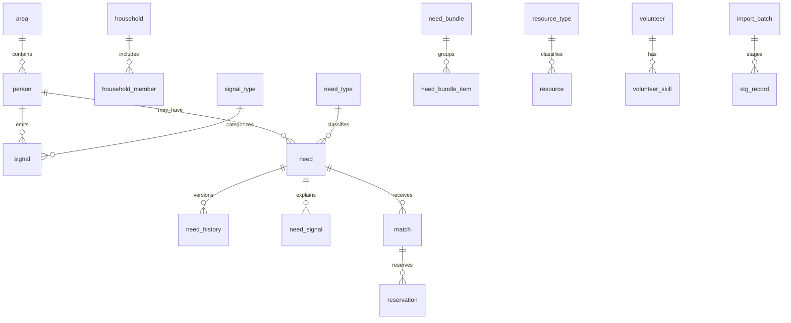
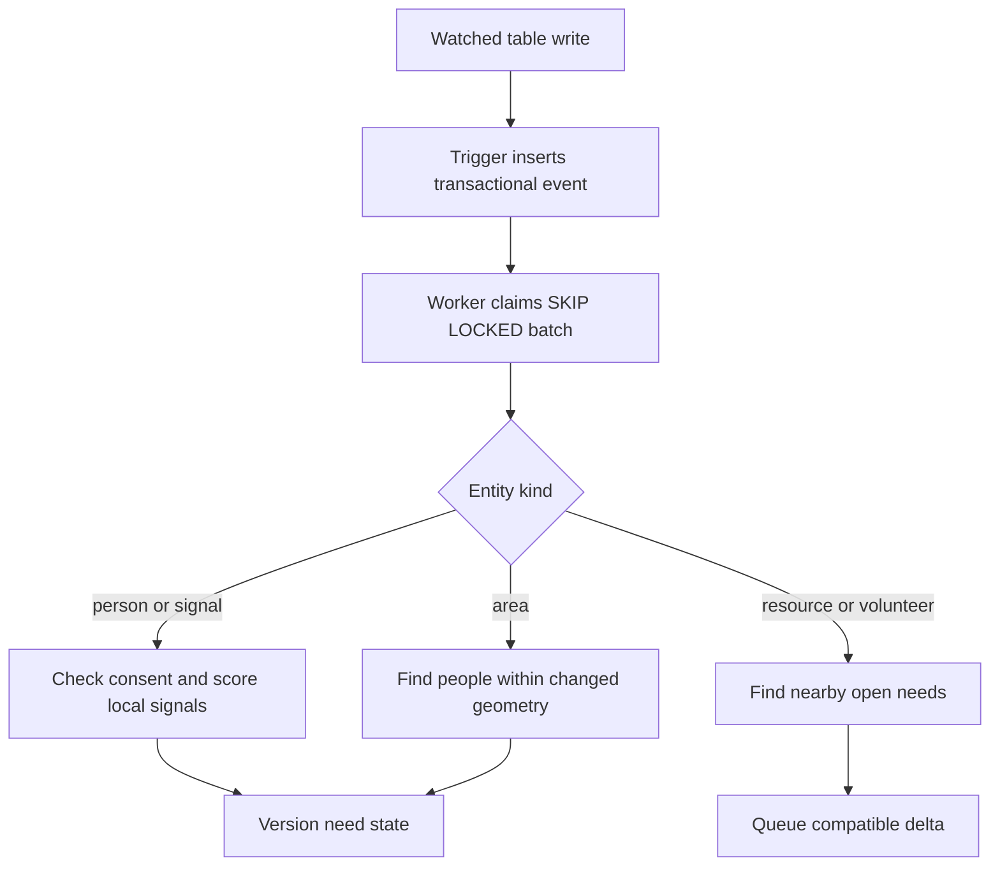
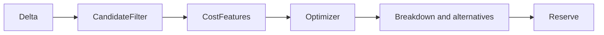
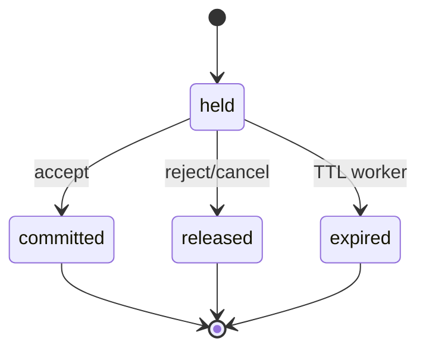
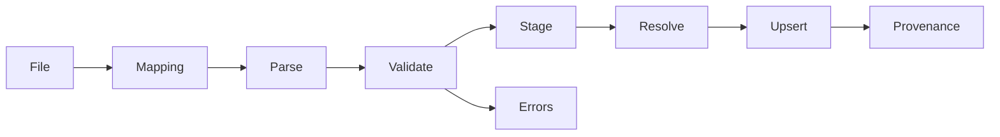
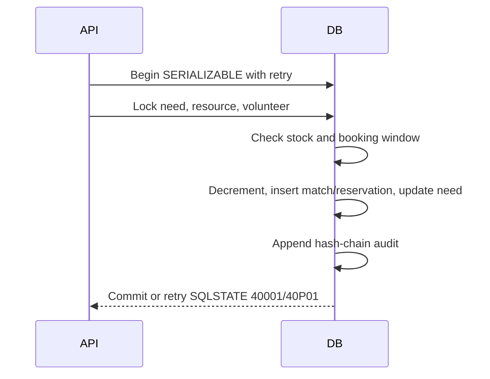

# Drawings

## System architecture

```mermaid
flowchart LR
 Import[Local files] --> Stage[Staging and mappings]
 API[FastAPI] --> PG[(PostgreSQL + PostGIS)]
 Stage --> PG
 PG --> Triggers[ECA triggers]
 Triggers --> Outbox[change_events]
 Outbox --> Worker[Delta worker]
 Worker --> Infer[Inference and candidate queue]
 Infer --> Match[Matching and reservation]
 Match --> PG
 PG --> Audit[audit_log]
```

## ER diagram

```mermaid
erDiagram
 area ||--o{ person : contains
 household ||--o{ household_member : includes
 person ||--o{ signal : emits
 signal_type ||--o{ signal : categorizes
 person ||--o{ need : may_have
 need_type ||--o{ need : classifies
 need ||--o{ need_history : versions
 need ||--o{ need_signal : explains
 need_bundle ||--o{ need_bundle_item : groups
 resource_type ||--o{ resource : classifies
 volunteer ||--o{ volunteer_skill : has
 need ||--o{ match : receives
 match ||--o{ reservation : reserves
 import_batch ||--o{ stg_record : stages
```

## ECA delta evaluation

```mermaid
flowchart TD
 W[Watched table write] --> T[Trigger inserts transactional event]
 T --> C[Worker claims SKIP LOCKED batch]
 C --> D{Entity kind}
 D -->|person or signal| P[Check consent and score local signals]
 D -->|area| A[Find people within changed geometry]
 D -->|resource or volunteer| R[Find nearby open needs]
 P --> V[Version need state]
 A --> V
 R --> Q[Queue compatible delta]
```

## Matching pipeline

```mermaid
flowchart LR
 Delta --> CandidateFilter --> CostFeatures --> Optimizer --> Explain[Breakdown and alternatives] --> Reserve
```

## Reservation state machine

```mermaid
stateDiagram-v2
 [*] --> held
 held --> committed: accept
 held --> released: reject/cancel
 held --> expired: TTL worker
 committed --> [*]
 released --> [*]
 expired --> [*]
```

## Import pipeline

```mermaid
flowchart LR
 File --> Mapping --> Parse --> Validate --> Stage --> Resolve --> Upsert --> Provenance
 Validate --> Errors
```

## Consistency sequence

```mermaid
sequenceDiagram
 API->>DB: Begin SERIALIZABLE with retry
 API->>DB: Lock need, resource, volunteer
 DB->>DB: Check stock and booking window
 DB->>DB: Decrement, insert match/reservation, update need
 DB->>DB: Append hash-chain audit
 DB-->>API: Commit or retry SQLSTATE 40001/40P01
```
